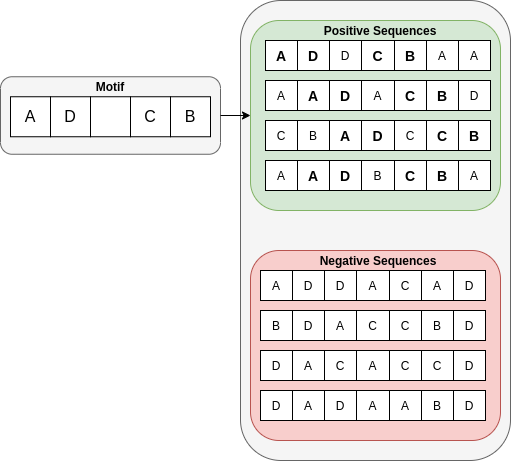
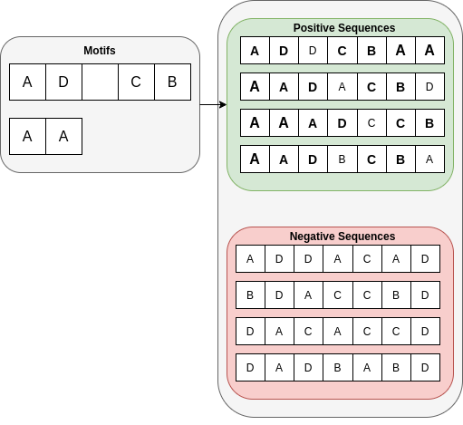
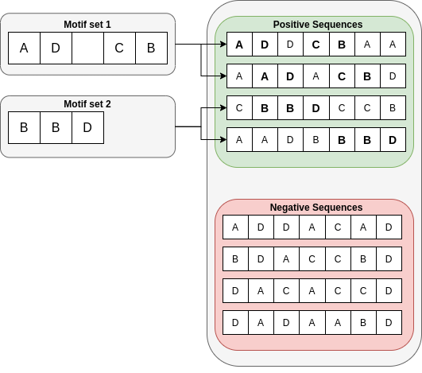
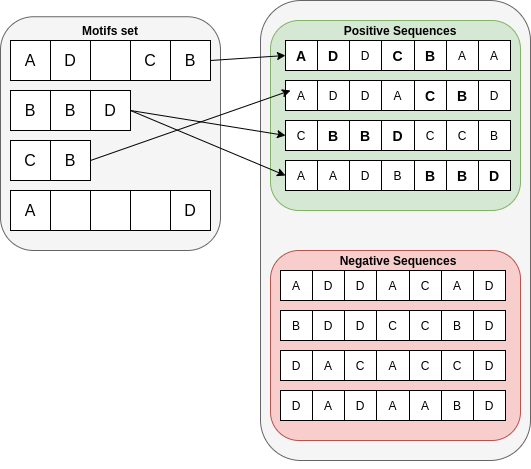

```{r setup, include=FALSE}
knitr::opts_chunk$set(echo = FALSE)
source("./experiments-results-summary.R")
```

# Przypomnienie

## Cel

+ każda sekwencja reprezentowana jako wiersz macierzy k-merów
+ Dla każdego $k$-meru: $k \in \{1, 2, 3, 4\};~d \in \{0,\dots,6\}$

Motywacja i cel pracy

+ redukcja wymiarowości przestrzeni $k$-merowej
+ filtrowanie $k$-merów


## Dane

Losowo generowane sekwencje:

+ długości 10
+ alfabet 6-elementowy
+ Prawdopodobieństwo elementów: `amylogram encoding`

Losowo generowane motywy:

+ postać $k$-meru: $k \in \{1, 2, 3, 4\};~d \in \{0,\dots,6\}$
+ prawdopodobieństwo elementów: `amylogram encoding`

## Metody

<div style="float: left; display: block; width: 50%;">

Filtry rankingowe

+ testy: QuiPT, $\chi^2$
+ SU, IG, GR
+ Information-Based: 
  NJMIM, MRMR, JMIM, JMI, DISR


</div>

<div style="float: right; width: 50%;">

Filtry nierankingowe

+ FCBF
+ QuiPT
+ $\chi^2$

</div>

## Analiza metod filtrowania k-merów

<div style="float: left; display: block; width: 50%;">

Schemat ewaluacji:

+ rankingi: siatka $k$-merów: $1-128, 2^i,8 \leq i \leq 12$
+ metryki: AUC, dokładność i inne
+ 5-fold CV

</div>

<div style="float: right; width: 50%;">

Modele:

+ LASSO
+ Random Forest
+ Naive Bayes
+ k-NN

</div>

## Eksperyment I

<center>
<figure>
    
  </figure>
</center>

## Eksperyment II

<center>
<figure>
    
  </figure>
</center>

## Eksperyment III

<center>
<figure>
    
  </figure>
</center>

## Eksperyment IV

<center>
<figure>
    
  </figure>
</center>


## Exp I - Baseline (1 motyw, 300 sekwencji) - wyniki

```{r}
plot_times(total_times)
```

## Wyniki cd.

```{r}
model = "LR LASSO"
metrics = c("Accuracy", "Sensitivity", "AUC")
knitr::kable(table_nonranking(nonranking_results, model, metrics))
```

## Wyniki cd.

```{r, fig.width=8, fig.height=5}
plot_ranking_results(ranking_results, "AUC")
```

# Pytania

## Pytanie I

Jak prezentować wyniki?

+ porównanie metod rankingowych z nierankingowymi
+ wygląd (dobór kolorów, typów linii itd.)
+ oddzielne porównanie najlepszych filtrów

## Pytanie 2

+ Czy eksperymenty III i IV są dobrze zaprojektowane?
+ Dobór wielkości zbioru motywów
+ Parametry łączenia zbiorów danych

## Pytanie 3 - Analiza filtrowanych k-merów

Czy porównanie podzbiorów $k$-merów jest sensowne?

Pomysły:

+ diagramy Venna
+ wordclouds
+ wyjaśnienie poprzez "dobry" klasyfikator

# Dziękuję za uwagę!


